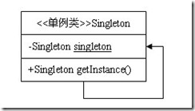
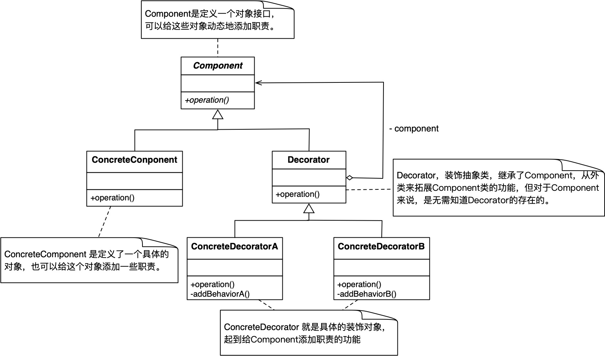
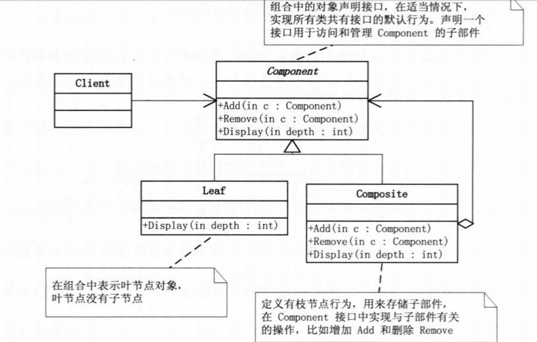

<!-- TOC -->

- [设计模式](#设计模式)
    - [创建型设计模式](#创建型设计模式)
        - [单例模式](#单例模式)
            - [实现方式](#实现方式)
            - [UML图](#uml图)
            - [使用方式](#使用方式)
    - [结构型设计模式](#结构型设计模式)
        - [装饰模式](#装饰模式)
            - [实现方式](#实现方式-1)
            - [UML图](#uml图-1)
            - [使用方式](#使用方式-1)
        - [组合模式](#组合模式)
            - [实现方式](#实现方式-2)
            - [UML图](#uml图-2)
            - [使用方式](#使用方式-2)
    - [行为型设计模式](#行为型设计模式)

<!-- /TOC -->
# 设计模式
## 创建型设计模式  
### 单例模式  
> 单例模式是一种创建型设计模式，能够保证一个类只有一个实例， 并提供一个访问该实例的全局节点  
#### 实现方式
+ 在类中添加一个私有静态成员变量初始化实例  
+ 将类的构造函数设为私有，使得其他对象不能调用  
+ 在静态方法中返回私有静态成员变量  
+ 将对单例的构造函数的调用替换为对其静态方法的调用  
> **1.在静态方法中延迟加载机制初始化实例存在并发问题,不建议使用**  
> **2.推荐使用私有静态内部类实现延迟加载**
#### UML图
  
#### 使用方式  
```
Singleton singleton = Singleton.getInstance();
```
## 结构型设计模式
### 装饰模式  
> 装饰模式允许你通过将对象放入包含额外行为的特殊封装对象中来为原对象绑定新的行为
#### 实现方式
+ 创建组件接口并在其中声明方法  
+ 创建具体组件类，并在其中定义基础行为  
+ 创建装饰基类，使用成员变量存储指向被装饰对象的引用，该成员变量必须被声明为组件接口类型，从而能在运行时连接具体组件和装饰。装饰基类必须将所有工作委派给被装饰的对象
+ 将装饰基类扩展为具体装饰，具体装饰必须在调用父类方法（总是委派给被封装对象） 之前或之后执行自身的行为
+ 客户端代码负责创建装饰并将其组合成客户端所需的形式  
> **确保所有类实现组件接口**  
#### UML图  
  
#### 使用方式  
```
Component component = new ConcreteDecoratorB(
    new ConcreteDecoratorA(
        new ConcreteComponent()
    )
);
```
### 组合模式  
> 组合模式可以将对象组合成树状结构， 并且能像使用独立对象一样使用它们  
#### 实现方式  
+ 确保应用的核心模型能够以树状结构表示，可以将其分解为简单元素和容器，容器必须能够同时包含简单元素和其他容器  
+ 声明组件接口及其一系列方法， 这些方法对简单和复杂元素都有意义  
+ 创建一个叶节点类表示简单元素，程序中可以有多个不同的叶节点类  
+ 创建一个容器类表示复杂元素。 在该类中，创建一个数组成员变量来存储对于其子元素的引用。 该数组必须能够同时保存叶节点和容器，因此确保将其声明为组合接口类型  
+ 在容器类中定义添加和删除子元素的方法  
#### UML图  
  
#### 使用方式  
```
Component component = new Composite();

Component leaf = new Leaf();
Component subComponent = new Composite();
component.Add(subComponent);
component.Add(leaf);

Component leafA = new Leaf();
Component leafB = new Leaf();
subComponent.Add(leafA);
subComponent.Add(leafB);

component.Display();
```
## 行为型设计模式