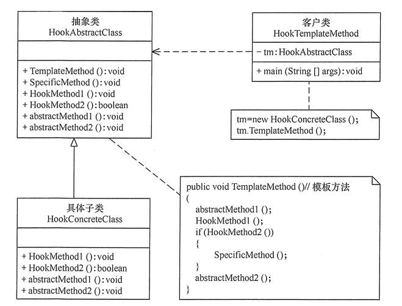

<!-- TOC -->

- [设计模式](#设计模式)
    - [创建型设计模式](#创建型设计模式)
        - [单例模式](#单例模式)
            - [实现方式](#实现方式)
            - [UML图](#uml图)
            - [使用方式](#使用方式)
        - [生成器模式](#生成器模式)
            - [实现方式](#实现方式-1)
    - [结构型设计模式](#结构型设计模式)
        - [装饰模式](#装饰模式)
            - [实现方式](#实现方式-2)
            - [UML图](#uml图-1)
            - [使用方式](#使用方式-1)
        - [组合模式](#组合模式)
            - [实现方式](#实现方式-3)
            - [UML图](#uml图-2)
            - [使用方式](#使用方式-2)
        - [代理模式](#代理模式)
            - [实现方式](#实现方式-4)
            - [UML图](#uml图-3)
            - [使用方式](#使用方式-3)
        - [适配器模式](#适配器模式)
            - [实现方式](#实现方式-5)
            - [UML图](#uml图-4)
            - [使用方式](#使用方式-4)
    - [行为型设计模式](#行为型设计模式)
        - [策略模式](#策略模式)
            - [实现方式](#实现方式-6)
            - [UML图](#uml图-5)
            - [使用方式](#使用方式-5)
        - [观察者模式](#观察者模式)
            - [实现方式](#实现方式-7)
            - [UML图](#uml图-6)
            - [使用方式](#使用方式-6)
        - [模板方法模式](#模板方法模式)
            - [实现方式](#实现方式-8)
            - [UML图](#uml图-7)
        - [责任链模式](#责任链模式)
            - [实现方式](#实现方式-9)
            - [UML图](#uml图-8)
            - [使用方式](#使用方式-7)

<!-- /TOC -->
# 设计模式
## 创建型设计模式  
### 单例模式  
> 单例模式是一种创建型设计模式，能够保证一个类只有一个实例， 并提供一个访问该实例的全局节点  
#### 实现方式
+ 在类中添加一个私有静态成员变量初始化实例  
+ 将类的构造函数设为私有，使得其他对象不能调用  
+ 在静态方法中返回私有静态成员变量  
+ 将对单例的构造函数的调用替换为对其静态方法的调用  
> **1.在静态方法中延迟加载机制初始化实例存在并发问题,不建议使用**  
> **2.推荐使用私有静态内部类实现延迟加载**
#### UML图
  
#### 使用方式  
```
Singleton singleton = Singleton.getInstance();
```  
### 生成器模式  
> 生成器模式能够分步骤创建复杂对象,该模式允许使用相同的创建代码生成不同类型和形式的对象
#### 实现方式
+ 
## 结构型设计模式
### 装饰模式  
> 装饰模式允许你通过将对象放入包含额外行为的特殊封装对象中来为原对象绑定新的行为
#### 实现方式
+ 创建组件接口并在其中声明方法  
+ 创建具体组件类，并在其中定义基础行为  
+ 创建装饰基类，使用成员变量存储指向被装饰对象的引用，该成员变量必须被声明为组件接口类型，从而能在运行时连接具体组件和装饰。装饰基类必须将所有工作委派给被装饰的对象
+ 将装饰基类扩展为具体装饰，具体装饰必须在调用父类方法（总是委派给被封装对象） 之前或之后执行自身的行为
+ 客户端代码负责创建装饰并将其组合成客户端所需的形式  
> **确保所有类实现组件接口**  
#### UML图  
  
#### 使用方式  
```
Component component = new ConcreteDecoratorB(
    new ConcreteDecoratorA(
        new ConcreteComponent()
    )
);
```
### 组合模式  
> 组合模式可以将对象组合成树状结构， 并且能像使用独立对象一样使用它们  
#### 实现方式  
+ 确保应用的核心模型能够以树状结构表示，可以将其分解为简单元素和容器，容器必须能够同时包含简单元素和其他容器  
+ 声明组件接口及其一系列方法， 这些方法对简单和复杂元素都有意义  
+ 创建一个叶节点类表示简单元素，程序中可以有多个不同的叶节点类  
+ 创建一个容器类表示复杂元素。 在该类中，创建一个数组成员变量来存储对于其子元素的引用。 该数组必须能够同时保存叶节点和容器，因此确保将其声明为组合接口类型  
+ 在容器类中定义添加和删除子元素的方法  
#### UML图  
  
#### 使用方式  
```
Component component = new Composite();

Component leaf = new Leaf();
Component subComponent = new Composite();
component.Add(subComponent);
component.Add(leaf);

Component leafA = new Leaf();
Component leafB = new Leaf();
subComponent.Add(leafA);
subComponent.Add(leafB);

component.Display();
```
### 代理模式
> 代理模式能够提供对象的替代品,代理对象控制着对原对象的访问，并允许在将请求提交给原对象前后进行一些处理
#### 实现方式
+ 代理作为服务类的子类或实现服务类接口  
+ 创建代理类，其中必须包含一个存储指向实际服务类的引用成员变量。在一些特殊情况下，客户端会通过构造函数将服务传递给代理  
+ 根据需求实现代理方法。 在大部分情况下，代理在完成一些任务后应将工作委派给服务对象
#### UML图
  
#### 使用方式  
```
Proxy proxy = new Proxy(new RealSubject());
proxy.request();
```  
### 适配器模式  
> 适配器模式能使接口不兼容的对象能够相互合作  
#### 实现方式  
+ 创建遵循客户端接口的适配器类,适配器类中添加一个成员变量用于保存对于服务对象的引用,通常情况下会通过构造函数对该成员变量进行初始化，但有时在调用其方法时将该变量传递给适配器会更方便  
+ 依次实现适配器类客户端接口的所有方法。适配器会将实际工作委派给服务对象，自身只负责接口或数据格式的转换  
+ 客户端必须通过客户端接口使用适配器,这样一来就可以在不影响客户端代码的情况下修改或扩展适配器  
> **适配器能为被封装对象提供不同的接口，代理模式能为对象提供相同的接口，装饰则能为对象提供加强的接口**  
#### UML图
  
#### 使用方式  
```
Target target = new Adapter(new Adaptee());
target.request();
```  
## 行为型设计模式  
### 策略模式  
> 策略模式，将每个算法实现放入一个单独的类中，可以在运行时进行替换  
#### 实现方式
+ 声明该算法所有变体类的通用策略接口  
+ 将算法逐一抽取到各自的类中，它们都必须实现策略接口  
+ 在上下文类中添加一个成员变量用于保存对于策略对象的引用，提供方法以修改该成员变量，上下文类通过策略接口同具体策略对象进行交互  
+ 客户端通过将上下文类与相应策略对象进行关联(或在运行时根据定义的条件运算选择某种替换算法),使上下文类可以以预期的方式完成其主要工作  
#### UML图
  
#### 使用方式  
```
Strategy StrategyA = new StrategyA();
Context context= new Context(StrategyA);
context.contextInterface();
```
### 观察者模式
> 观察者模式允许你定义一种订阅机制,可在对象事件发生时通知多个观察该对象的其他对象  
#### 实现方式  
+ 声明订阅者接口，该接口至少应包含一个update方法  
+ 声明发布者接口并定义方法来在列表中添加和删除订阅对象，发布者必须仅通过订阅者接口与它们具体订阅者进行交互  
+ 创建具体发布者类，发布者类使用列表维护订阅者对象，每次发布者发生了重要事件时都必须通知所有的订阅者  
+ 在具体订阅者类中实现通知更新的方法。绝大部分订阅者需要一些与事件相关的上下文数据，这些数据可作为通知方法的参数来由具体发布者传递到订阅者  
+ 客户端必须生成所需的全部订阅者，并在相应的发布者处完成注册工作。
#### UML图
  
#### 使用方式  
```
Subscriber subscriber = new ConcreteSubscriber();
Publisher publisher = new Publisher();
publisher.subscribe(subscriber);
```
### 模板方法模式
> 模板方法模式通过在父类中定义算法的框架，允许子类在不修改结构的情况下重写算法的特定步骤  
#### 实现方式  
+ 分析目标算法，确定能否将其分解为多个步骤，从所有子类的角度出发，考虑哪些步骤能够通用，哪些步骤各不相同  
+ 创建抽象基类并声明一个模板方法和代表算法步骤的一系列抽象方法，在模板方法中根据算法结构依次调用相应步骤。可用final修饰模板方法以防止子类对其进行重写  
+ 为每个算法变体新建一个具体子类，重写部分可选步骤  
#### UML图

### 责任链模式  
> 责任链模式允许你将请求沿着处理者链进行发送。收到请求后，每个处理者均可对请求进行处理或将其传递给链上的下个处理者。  
#### 实现方式  
+ 声明责任链上所有具体处理者的通用接口，该接口通常包含单个方法用于请求处理，但有时其还会包含一个设置责任链上下个处理者的方法  
+ 为了在具体处理者类中消除重复的样本代码，你可以根据处理者接口创建抽象处理者基类,该类需要有一个成员变量来存储指向责任链上下个处理者的引用  
+ 依次创建具体处理者子类并实现其处理方法,每个处理者在接收到请求后都必须做出两个决定：是否处理这个请求或是否将该请求沿着链进行传递  
+ 客户端可以自行组装链或者从其他对象处获得预先组装好的链。在后一种情况下必须实现工厂类以根据配置或环境设置来创建链  
#### UML图

#### 使用方式
```
Handler handler = new ConcreteHandlers();
Handler nextHandler = new ConcreteHandlers();
handler.setNext(nextHandler);
handler.handle(request);
```
