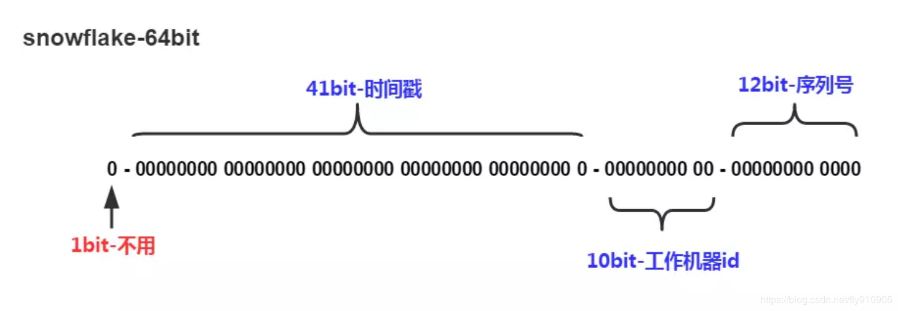

# Distributed 
<!-- TOC -->

- [Distributed](#distributed)
    - [基本原则](#基本原则)
        - [CAP](#cap)
        - [BASE](#base)
    - [分布式事务](#分布式事务)
        - [2PC](#2pc)
        - [3PC](#3pc)
        - [TCC](#tcc)
        - [MQ](#mq)
            - [本地消息存储方案](#本地消息存储方案)
            - [全局消息存储方案](#全局消息存储方案)
    - [其它事项](#其它事项)
        - [负载均衡](#负载均衡)
            - [注意事项](#注意事项)
        - [全局ID生成](#全局id生成)
            - [数据库实现](#数据库实现)
            - [Redis实现](#redis实现)
            - [snowflake方案](#snowflake方案)

<!-- /TOC -->
## 基本原则  
### CAP
+ C&#160; &#160; 一致性  
+ A&#160; &#160; 可用性
+ P&#160; &#160; 分区容错性  
> &#160; &#160; &#160; &#160; 在一个分布式系统中，无法同时满足CAP，最多只能满足两者，大多数情况下选择满足AP，即可用性与分区容错性
### BASE
> &#160; &#160; &#160; &#160;BASE定理是对CAP中一致性与可用性权衡的结果，其核心思想是保证系统满足最终一致性，不追求强一致性  
+ 基本可用
> &#160; &#160; &#160; &#160;分布式系统在出现不可预知的故障前提下，允许损失部分可用性
+ 软状态
> &#160; &#160; &#160; &#160;允许分布式系统中的数据存在中间状态，即允许系统在不同节点的数据副本之间进行数据同步的过程存在延时，当不影响系统整体的可用性
+ 最终一致性
> &#160; &#160; &#160; &#160;分布式系统在经过一定时间数据同步后可以达到最终一致性，不需要实时保证系统数据的强一致性
## 分布式事务
### 2PC
+ 角色  
> &#160; &#160; &#160; &#160;协调者与参与者
+ 过程  
> &#160; &#160; &#160; &#160;准备阶段：协调者向所有参与者发送prepared消息，参与者在收到prepared消息后在本地执行事务但不提交，返回事务的执行结果  
>  
> &#160; &#160; &#160; &#160;提交阶段：如果协调者收到某个参与者的事务失败结果或超时未收到事务执行结果，则向所有参与者发送rollback消息，否则则发送commit消息。
+ 问题  
> &#160; &#160; &#160; &#160;单点故障：如果协调者发生故障，则所有参与者将阻塞  
>  
> &#160; &#160; &#160; &#160;同步阻塞：在提交过程中，所有参与者的操作都处于阻塞的状态，等待协调者的消息
### 3PC
+ 角色  
> &#160; &#160; &#160; &#160;协调者与参与者  
+ 过程  
> &#160; &#160; &#160; &#160;canCommit阶段：协调者向所有参与者发送canCommit消息，参与者在收到canCommit消息后，根据自身的状态，返回YES or NO  
>  
> &#160; &#160; &#160; &#160;preCommit阶段：如果协调者收到参与者canCommit阶段的NO消息或超时未收到，则事务中断执行。否则，进入preCommit阶段，向所有参与者发送preCommit消息，参与者在收到preCommit消息后，开始执行事务当不提交，返回事务的执行结果  
>  
> &#160; &#160; &#160; &#160;doCommit阶段：如果协调者收到某个参与者事务执行失败的消息或超时未收到，则向所有参与者发送rollback消息，否则发送commit消息  
+ 特点  
> &#160; &#160; &#160; &#160;3PC在参与者中引入了超时机制，如果超时未收到协调者发送的commit或rollback消息，将自动commit本地事务，降低了参与者的阻塞范围  
>  
> &#160; &#160; &#160; &#160;3PC力求事务的最终一致性，后期可引入check机制，检测参与者事务是否一致性，如果不一致则尝试执行参与者的事务，必要时可引入人工介入的方式
### TCC  
+ 角色  
> &#160; &#160; &#160; &#160;协调者与参与者  
+ 过程  
> Try阶段：协调者向所有参与者发送try消息，参与者完成所有的业务检查，预留必须的业务资源  
>  
> Confirm/Cancel阶段：协调者根据参与者返回的try结果。如果有参与者返回try失败消息或超时，协调者向所有参与者发送Cancel消息。如果所有参与者返回try成功消息，协调者向所有参与者发送Confirm消息，真正执行业务逻辑  
+ 特点  
> &#160; &#160; &#160; &#160;与2PC，3PC相比，TCC是应用层协议，灵活性高  
>  
> &#160; &#160; &#160; &#160;TCC追求事务的最终一致性，后期可引入check机制，检测参与者事务是否一致性，如果不一致则尝试执行参与者的事务，必要时可引入人工介入的方式
### MQ  
+ 保证上游分布式事务的参与者本地事务执行成功与消息发送成功是原子性操作  
  
+ 保证下游消息消费者对同一个消息不能重复消费（每个消息带有ID，有效避免重复消费）  
  
+ 基于MQ的方案，整个分布式事务的每个参与者都是异步执行的，只需关心自己本地事务执行成功及消息投递成功即可  
  
+ 当系统出现不一致时，无需考虑回滚，可以通过消息业务数据进行检查，对系统进行适当的补偿（尝试在事务执行失败的参与者重新执行未成功执行的事务）或人工介入来保证系统的最终一致性  
#### 本地消息存储方案
  
+ 事务参与者存储消息表  
+ 执行本地事务时，同时记录一条消息到DB中，消息状态设置为待投送，消息记录与业务执行在同一个事务中  
+ 定时轮询消息表，将待投送的消息投递到MQ中，投递成功后，从消息表中将状态修改为已投递  
+ 缺点  
> 每个事务参与者需要建立专门的消息表存储消息，消息存储过于分散，不利于后期统一的轮询检查
#### 全局消息存储方案
  
+ 消息存储与MQ提供统一的服务，所有事务的参与者消息全局存储在一起  
+ 消息生产者在执行业务本地事务前向消息服务发送一条消息，状态设置为待投递  
+ 提供Check机制，主动询问消息生产者本地事务是否执行成功，如果成功将对应的消息状态设置为可投递  
+ 定时轮询全局消息表，将状态为可发送的消息投递到MQ中，发送成功后，将消息状态修改为已投递
## 其它事项
### 负载均衡  
+ 随机分配策略  
> &#160; &#160; &#160; &#160;将请求进行随机分配，实现简单，当确会造成出现负载不均衡的现象  
+ 轮询分配策略
> &#160; &#160; &#160; &#160;轮询依次分配到不同的主机上，没有考虑主机中性能影响，无法发挥不同主机的性能
+ 权重轮询策略
> &#160; &#160; &#160; &#160;给不同主机设置不同的权重，权重大的服务器负载的更多，但确不适应对命中率有特殊要求的场合
+ 哈希取模策略
> &#160; &#160; &#160; &#160;利用哈希函数进行取模，可以实现固定的主机分配，当出现主机出现宕机时，命中率会极速的下降
+ 一致性哈希策略
> &#160; &#160; &#160; &#160;利用一致性哈希算法，将主机构成哈希环，取模运算后分配到最近邻的主机上，在出现主机宕机时，不会对命中率造成过多的影响
+ 动态负载均衡策略
> &#160; &#160; &#160; &#160;通过对服务器集群的状态监控，量化不同服务器的性能差异，动态调整每个服务器的权重  
#### 注意事项  
+ 哈希取模策略与一致性哈希策略有大概率出现负载不均衡的现象，这个时候可以通过增加虚拟节点，可以在一定程度上避免负载不均衡  
+ 具体策略的选择应该根据具体的业务场景进行选择，一般推荐权重轮询策略、动态负载均衡策略或一致性哈希策略
### 全局ID生成
> 在分布式系统中，许多业务的数据往往需要依赖全局唯一的ID进行标识，这是需要进行全局ID的生成，基本要求ID尽可能满足递增性能，生成的性能高，具有高QPS  
#### 数据库实现  
+ 利用数据库生成全局唯一递增ID
+ 生成性能依赖数据库的读写性能影响  
#### Redis实现
+ 依赖Redis单线程运行的特点，incr命令原子执行特点，保证全局唯一
+ 实现简单，性能高，推荐使用  
#### snowflake方案
  
+ 利用集群生成全局ID，性能极高，可从集群中不同机器上获取全局ID
+ 强依赖机器时钟，如果机器上时钟出现错误（回拨），可能会导致发号重复