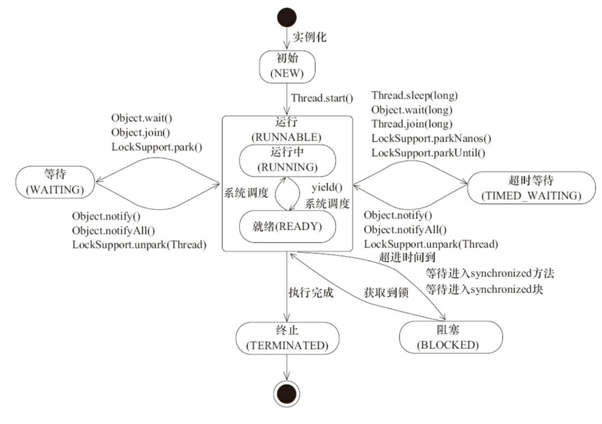
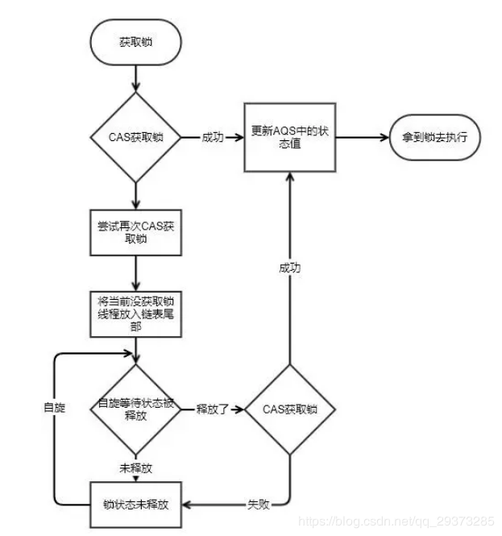

# Java Thread  
<!-- TOC -->

- [Java Thread](#java-thread)
    - [线程状态](#线程状态)
    - [创建线程](#创建线程)
        - [Runnable与Callable的区别](#runnable与callable的区别)
    - [线程通信](#线程通信)
    - [线程池](#线程池)
        - [线程池种类](#线程池种类)
        - [ThreadPoolExecutor](#threadpoolexecutor)
        - [注意点](#注意点)
        - [工作原理](#工作原理)
        - [线程数设置](#线程数设置)
        - [线程池好处](#线程池好处)
    - [线程同步](#线程同步)
        - [Volatile](#volatile)
        - [Synchronized](#synchronized)
        - [Lock](#lock)
        - [Lock实现原理](#lock实现原理)
        - [Lock与synchronized如何选择的问题](#lock与synchronized如何选择的问题)

<!-- /TOC -->
## 线程状态  
  
+ New（开始）
> &#160; &#160; &#160; &#160;在没有调用start()方法之前  
+ Runnable（可运行）
> &#160; &#160; &#160; &#160;已经调用start()方法的线程状态，Java将传统操作系统的就绪等待状态与运行态统称为Runnable  
+ Block（阻塞）
> &#160; &#160; &#160; &#160;1.线程等待获取监视器锁（Synchronized）以期进入同步代码块或方法  
> &#160; &#160; &#160; &#160;2.线程进入同步代码块或方法中，调用Object.wait()方法等待并释放锁，被其它线程唤醒后，试图重新获取同步代码快或方法的锁，此时进入Block状态  
+ Waiting（等待）
> 线程调用Object.wait()方法，进入等待状态  
+ Timed_Waiting（超时等待）  
> 线程调用Object.wait(long)或sleep进入超时等待状态  
+ Terminated（终止）  
> 线程执行结束或异常退出，线程进入终止状态
## 创建线程  
+ 继承Thread类
+ 实现Runnable接口
+ 实现Callable接口
+ 使用线程池
### Runnable与Callable的区别
+ Callable是有返回值的任务，覆盖call方法，可以抛出异常
+ Runnable是无返回值的任务，覆盖run方法，不能抛出异常
> &#160; &#160; &#160; &#160;两者都可以用于创建线程和提交到线程池中，Callable通过配套的Future接口获取执行结果，使用Future.get()来获取Callable的返回值，Future.get()调用会阻塞当前线程，直到对应的Callable返回值为止。**[FutureTask类是既实现Future接口又实现Runnable接口的类，更加的方便使用]**  
## 线程通信
+ 等待/通知
> &#160; &#160; &#160; &#160;使用Object类提供的wait()/notify()/notifyAll()方法实现。wait()/notify()/notifyAll()的方法调用必须在获取到该Object类代表的对象锁的同步代码块或同步方法里，否则程序运行时会抛出异常  
> + wait()方法调用使得调用线程停止执行并等待，同时释放该Object类代表的对象锁  
>  
> + notify()方法调用会从等待的线程中随机唤醒一个线程，当前线程执行完notify()方法后并不会马上释放该Object类代表的对象锁，而是退出同步代码块后才会释放该对象锁  
>  
> + notifyAll()方法原理同notify()方法，只不过是唤醒所有等待的线程
+ 管道
> &#160; &#160; &#160; &#160;Java中管道（pipeStream）是一种特殊流，用于在不同线程间传送数据。一个线程将数据发送到输出管道，另一个线程从输入管道中接收数据，传输媒介为内存，无需借助临时文件
+ Condition  
> + Condition对象是由Lock对象创建出来的 **[调用Lock的newCondition()创建]**，当前线程调用Condition对象的await()/signal()方法时必须在获取到该Condition对象关联锁的同步代码块里，否则程序运行时会抛出异常。await()/signal()方法的作用与Object类提供的wait()/notify()方法类似  
>  
> + Condition对象与Object类提供的wait()/notify()最大的不同之处在于：一个Lock对象可以创建多个Condition对象，这就等于可以将同时竞争一把锁的多个线程按照Condition对象分组，可以实现更佳复杂的线程流程控制  
## 线程池  
### 线程池种类
> &#160; &#160; &#160; &#160;JDK将工作单元与执行机制分离，工作单元主要是Runnable与Callble，执行机制由Executor框架提供。  
> &#160; &#160; &#160; &#160;Java通过工具类Executors的静态方法来获取线程池，线程池主要包含以下几类:
+ newSingleThreadExecutor  
> &#160; &#160; &#160; &#160;线程池中只有一个线程在工作，保证所有提交的任务按照指定顺序[优先级，FIFO等]执行  
+ newCacheThreadPool  
> &#160; &#160; &#160; &#160;可缓存线程池，如果线程池中有当前执行线程的缓存，就复用该线程。如果没有，则创建一个新的线程来完成当前任务。这类线程池只适合完成一些生存期很短的任务，newCacheThreadPool规定可以复用的线程空闲时间不能超过60秒，一旦超过了60秒，该线程就会被移除线程池。
+ newFixedThreadPool  
> &#160; &#160; &#160; &#160;固定线程数量的线程池，一旦线程池中的线程都在进行工作，那么新的任务将进行排队等待，直到线程池中有空闲的时候才能够进入线程池。  
+ newScheduledThreadPool  
> &#160; &#160; &#160; &#160;调度型线程池，适合需要定时或周期性任务执行的场合
### ThreadPoolExecutor  
> ThreadPoolExecutor类是线程池中最核心的一个类。newSingleThreadExecutor，newCacheThreadPool与newFixedThreadPool利用ThreadPoolExecutor构建。ThreadPoolExecutor构建参数如下：  
+ corePoolSize  
> &#160; &#160; &#160; &#160;核心池大小。创建线程池后，默认情况下，线程池中没有任何线程，而是等待有任务到来时才创建线程去执行任务  
+ maximumPoolSize  
> &#160; &#160; &#160; &#160;线程池最大线程数，表示线程池最多能创建多少个线程  
+ keepAliveTime  
> &#160; &#160; &#160; &#160;线程没有任务执行时，最多保持多久时间会终止，线程池中的线程数大于corePoolSize时，keepAliveTime才会起作用  
+ unit  
> &#160; &#160; &#160; &#160;keepAliveTime的时间单位[天，小时，分钟，秒，毫秒，微秒，纳秒]  
+ workQueue  
> &#160; &#160; &#160; &#160;阻塞队列，用来存储等待执行的任务[常见的workQueue选择有ArrayBlockingQueue，LinkedBlockingQueue，SynchronousQueue]  
+ threadFactory  
> &#160; &#160; &#160; &#160;主要用来创建线程的线程工厂  
+ handler  
> &#160; &#160; &#160; &#160;拒绝处理任务时的策略[常用策略有：丢弃任务并抛出异常|丢弃任务，但是不抛出异常|丢弃队列最前面的任务，然后重新尝试执行任务|由调用线程处理该任务]  
### 注意点  
+ 当线程数目小于corePoolSize时，对于新提交的任务，会创建新线程执行该任务  
+ 当线程数目等于corePoolSize时，对于新提交的任务会加入阻塞队列中  
+ 当阻塞队列满时，且线程数目小于maximumPoolSize时，对于新提交的任务会创建新线程执行
### 工作原理  
> &#160; &#160; &#160; &#160;ThreadPoolExecutor内部维护一个workers集合和一个workQueue任务阻塞队列。线程池内部真正执行的线程实体是worker对象，worker对象实现了Runnable接口，覆盖的run方法中定义了一个runWoker的方法，runWorker方法通过for循环不停的从workQueue任务阻塞对象中获取对应的任务，同步调用这个任务的run方法执行。  
>  
> &#160; &#160; &#160; &#160;对于用户提交的任务，如果当前worker对象数目小于corePoolSize定义的大小，便创建一个worker执行对象，并将当前创建的worker对象执行的第一个任务指向为用户提交的任务。否则便将用户提交的任务加入到workQueue阻塞队列中。  
### 线程数设置
> 利特尔法则（Little’s Law）  
> 线程池大小=(线程 CPU时间+线程IO时间)/线程CPU时间×CPU核数
### 线程池好处
> &#160; &#160; &#160; &#160;在实际开发中，如果每个请求到达服务器就创建一个新线程为其服务，开销是相当大的。服务器在创建和销毁线程上花费的时间和消耗的系统资源是非常大的。如果在一个JVM里创建太多的线程，可能会使系统由于过度内存消耗或线程上下文切换过度而导致系统资源不足，甚至拖垮服务器。  
> &#160; &#160; &#160; &#160;线程池可以应对突然大爆发量的访问，通过有限个固定数量线程为大量的操作服务，减少创建和销毁线程所需的时间。
## 线程同步  
### Volatile
+ 轻量级的同步机制  
+ 采用在多处理器中保证共享变量的可见性原理进行同步  
> &#160; &#160; &#160; &#160;Java中被申明为volatile的变量，一个线程的修改，另一个线程可以立刻读到这个修改值。原理是volatile变量被修改，处理器会将volatile变量所在的cache缓存行立刻写入到内存中，造成其它处理器缓存的volatile变量会无效，当其它处理器操作volatile变量时需要重新从内存中读取。
### Synchronized  
+ 重量级锁，可以用于同步方法，同步静态方法，同步代码块,Java中每个对象都可以作为锁
+ synchronized是可重入锁,同一个线程可多次获取到锁
+ synchronized用于同步方法时，锁是当前的对象实例  
+ synchronized用于同步静态方法时，锁是当前类Class对象  
+ synchronized用于同步代码块时，锁是当前括号中配置的对象  
> &#160; &#160; &#160; &#160;JVM为了减轻synchronized的消耗，提高synchronized的效率，将synchronized用的锁划分为偏向锁—>轻量级锁-->重量级锁，锁依据竞争的激烈程度由低到高开始衍化，锁不能降级，这种区别主要是靠在锁的对象头里面的字段[Java所有对象都有一个对象头，对象头记录着锁]  

| 锁 | 优点 |缺点 | 适用场景 |
| ------ | ------ |------ |  ------ |
| 偏向锁 | 加锁与解锁不需要额外的消耗，和执行非同步方法相对仅存在细微的差距|定如果线程间存在锁竞争，会带来额外的偏向锁撤销消耗|  适用于只有一个线程访问同步块的场|
| 轻量级锁 | 竞争的线程不会阻塞，使用自旋操作获取锁，提高了程序的响应速度 |始终得不到锁的线程，使用自旋方式获取锁会消耗CPU资源| 追求响应时间，同步块执行速度非常的快的场合|
| 重量级锁 | 线程竞争锁不使用自旋，不会消耗CPU资源 |线程阻塞，响应时间缓慢|追求吞吐量，同步块执行速度较长的场合 | 
### Lock  
> &#160; &#160; &#160; &#160;是Java针对synchronized不能响应中断，没有超时机制，且只支持非公平锁的缺陷而提供的更灵活多线程同步方案。利用对volatile同步状态变量的CAS操作进行同步（具体可以查看AQS抽象队列同步器源码，里面定义了大量的volatile变量以及对volatile变量的CAS操作函数，同时定义了一些模板方法，Lock是利用AQS实现）  
+ 具体的实现类是ReentrantLock[可重入锁，实现接口：Lock]与ReentrantReadWrieLock[可重入的读写锁,实现接口：ReadWriteLock]  
  
+ ReentrantLock：通过lock()[获取锁]、lockInterruptibly()[可响应中断获取锁]、tryLock(time)[超时获取锁]方法获取锁，使用unlock()方法释放锁。  
  
+ ReentrantLock是典型的互斥锁，只允许一个线程执行同步代码块，在某些特殊的应用场景中，例如多线程的文件读写，读与读之间是不互斥的，只有在有线程进行写入的条件下其它线程才无法操作文件  
  
+ 针对这种特殊的应用场景，Java提供ReentrantReadWrieLock解决方案。ReentrantReadWrieLock中包含两个锁，分别是读锁[共享锁]与写锁[互斥锁]。通过readlock()方法获取操作读锁的对象，writelock()方法获取操作写锁的对象  
### Lock实现原理
  
+ 尝试CAS获取锁，如果获取成功，更新AQS中锁的状态
+ 如果获取失败，则再次尝试CAS获取锁，如果还是不成功，则将当前线程插入AQS队列尾部
+ AQS队列中保存的每个线程通过自旋判断当前线程是否在队列头部且CAS获取到锁，则当前线程成功获取到锁，从AQS队列中移除，否则一直自旋判断  
### Lock与synchronized如何选择的问题  
> &#160; &#160; &#160; &#160;Lock内部使用对volatile变量的CAS操作进行同步，CAS是CPU指令级的原子操作，不会阻塞线程，通过自旋重试操作实现，仍会占有CPU使用时间，在线程冲突严重时会造成CPU压力过大，导致系统吞吐量下降。synchronized通过监视器monitorenter和monitorexit去获取锁与释放锁，是JVM级别实现的锁，获取不到锁的线程会被阻塞让出CPU时间，在线程冲突严重时，系统仍然会有较高的吞吐量  
>  
> &#160; &#160; &#160; &#160;Lock提供了许多synchronized不具备的功能，例如：可响应中断，超时获取锁机制，支持公平锁等，但是在具体使用时，还是应该根据具体的应用场景进行选择