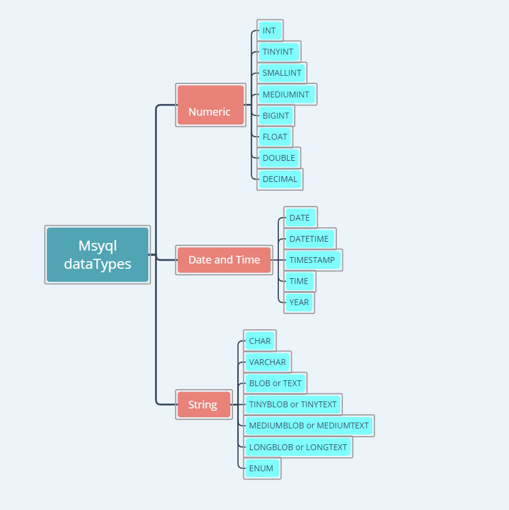
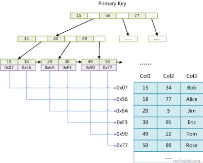
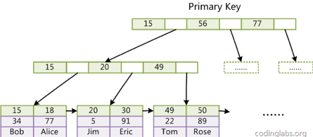
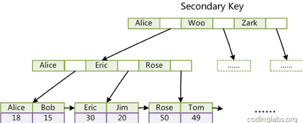

# MySQL  
<!-- TOC -->

- [MySQL](#mysql)
    - [数据类型](#数据类型)
        - [数值类型](#数值类型)
        - [日期时间类型](#日期时间类型)
        - [字符串类型](#字符串类型)
    - [存储引擎](#存储引擎)
        - [MyISAM](#myisam)
        - [InnoDB](#innodb)
    - [索引](#索引)
        - [哈希索引](#哈希索引)
        - [B+树索引](#b树索引)
        - [非聚簇索引与聚簇索引](#非聚簇索引与聚簇索引)
        - [使用事项](#使用事项)
    - [事务](#事务)
        - [事务基本原则](#事务基本原则)
        - [事务隔离级别](#事务隔离级别)
    - [锁](#锁)
        - [表级锁](#表级锁)
        - [行级锁](#行级锁)
        - [注意事项](#注意事项)
        - [锁类型兼容表](#锁类型兼容表)
    - [MVCC](#mvcc)
        - [应用背景](#应用背景)
        - [实现机制](#实现机制)
        - [访问策略](#访问策略)
        - [使用事项](#使用事项-1)
    - [日志系统](#日志系统)
        - [redolog](#redolog)
        - [binlog](#binlog)

<!-- /TOC -->
## 数据类型  
### 数值类型  
| 类型 | 大小 |存储用途 |
| ------ | ------ |------ |
| tinyint | 1字节 |整数|
| smallint | 2字节 |整数|
| mediumint | 3字节 |整数|
| int | 4字节 |整数|
| bigint | 8字节 |整数|
| float | 4字节 |浮点数|
| double | 8字节 |浮点数|
| decimal |(M，D) |高精度数|
M指定数的最大位数，D指定小数点后的位数
### 日期时间类型  
| 类型 | 大小 |格式 |存储用途|
| ------ | ------ |------ |------ |
| date | 3字节 |YYYY-MM-DD|日期值|
| time | 3字节 |HH:MM:SS|时间值|
| year | 1字节 |YYYY|年份值|
| datatime | 8字节 |YYYY-MM-DD HH:MM:SS	|日期与时间值|
| timestamp | 4字节 |XXXXX|时间戳|
### 字符串类型
| 类型 | 大小 |存储用途 |
| ------ | ------ |------ |
| char | 0-255字节 |定长字符串|
| varchar | 0-65535字节 |变长字符串|
| tinyblob | 0-255字节 |不超过255个字符的二进制串|
| blob | 64K |不超过64K的二进制串|
| mediumblob | 16M |不超过16M的二进制串|
| longblob | 4GB |不超过4GB的二进制串|
| tinytext | 0-255字节 |不超过255个字符的字符串|
| text | 64K |长文本字符串|
| mediumtext | 16M |长文本字符串|
| longtext | 4GB |长文本字符串|

## 存储引擎  
> MySQL主要有两种存储引擎，分别是MyISAM与InnoDB
### MyISAM  
+ 不支持行锁，使用表锁  
+ 不支持事务与外键  
+ 不支持数据库奔溃后的安全恢复  
+ 使用非聚簇索引
+ 支持全文索引  
+ MySQL-5.5之前默认的存储引擎
### InnoDB  
+ 支持行锁
+ 支持事务与外键
+ 采用MVCC支持高并发
+ 支持数据库奔溃后的安全恢复  
+ 使用聚簇索引  
+ 不支持全文索引  
+ MySQL-5.5之后默认的存储引擎  

> &#160; &#160; &#160; &#160;InnoDB支持行锁、事务及外键，采用MVCC实现数据库的高并发，具有数据库奔溃后的安全恢复机制，是MySQL在大多数应用场景下首选的存储引擎
## 索引  
> &#160; &#160; &#160; &#160;索引是存储引擎快速查找记录的特殊数据结构,使用索引后可以不用扫描全表来定位某行的相应数据，而是通过索引找到该行数据对应的物理地址然后访问相应的数据，极大加快查询的速度  
### 哈希索引  
> &#160; &#160; &#160; &#160;哈希索引基于哈希表数据结构实现，只有内存存储引擎支持哈希索引。内存存储引擎会对索引的数据列计算一个hashcode，通过hashcode值计算在哈希表中的存储位置，并在该位置存储索引数据对应所在行物理地址。(采用拉链法解决哈希冲突)  
+ 由于哈希索引是散列的分布存储方式，不支持范围查找与排序
### B+树索引  
> &#160; &#160; &#160; &#160;B+树索引基于B+树数据结构实现，B+树特点：  
+ B+树平衡搜索多叉树  
+ 所有叶子结点的高度一样  
+ 非叶子节点只保存索引，所有数据都保存在叶子节点  
+ 叶子结点本身依据索引的大小自小而大顺序链接  
+ B+树索引支持范围查找与排序  

  
> &#160; &#160; &#160; &#160;B+树索引具体实现方式在MyISAM与InnoDB存储引擎有所不同
> &#160; &#160; &#160; &#160;
### 非聚簇索引与聚簇索引  
+ MyISAM  
> &#160; &#160; &#160; &#160;非聚簇索引实现方式，索引与数据是分开存储的。索引检索时，首先按照B+树检索算法搜索索引，如果找到，则取其data域的值，并以data域的值为地址读取相应的数据记录。  
  
+ InnoDB  
> &#160; &#160; &#160; &#160;聚簇索引实现方式,采用主键索引与数据是存储在一起的方式。主键索引称为主索引，其它索引称为辅助索引。辅助索引data域存储相应记录主键值，主索引data域存储存储完整的数据记录。主索引检索时，按照主键检索B+树，如果找到，从data域直接读取相应的数据记录。辅助索引检索时，首先按照索引检索B+树，如果找到，从data域中获取主键，在从主索引中检索，获取相应的数据记录。  
> **主索引**  
>   
>  
> **辅助索引**  
>   
### 使用事项  
+ 最左前缀原则  
> &#160; &#160; &#160; &#160;对于由多个数据列构成的联合索引，查询时如果匹配到左边连续一列或多列，则可以命中索引，否则将不会使用索引。查询时如果顺序不同，mysql查询优化器会自动优化查询条件的顺序，尽量保证查询条件包含左边连续一列或多列  
+ 尽量避免对where子句查询条件使用函数，这将造成无法命中索引  
+ InnoDB存储引擎尽量使用自增主键，不要使用业务列做为主键  
+ 合理使用索引覆盖，即查询的字段可以直接从索引中获取  
> select id,name from user where name='ustc';  
> 如果name字段建立了索引，这条sql语句从name辅助索引中检索到id，即可获取到id与name，无需再从主索引中检索数据，查询速度更快  
+ 对于like查询条件，如果以%开头，将无法命中索引
## 事务
### 事务基本原则  
+ A（原子性）  
+ C（一致性）  
+ I（隔离性）
+ D（持久性）  
### 事务隔离级别  
+ 读未提交  
> &#160; &#160; &#160; &#160;存在脏读，即读取到其它事务未提交的数据  
+ 读已提交  
> &#160; &#160; &#160; &#160;存在不可重复读，即两次读取的数据，值不相同  
+ 可重复读  
> &#160; &#160; &#160; &#160;解决了不可重复读的问题，但会产生幻读，即两次读取，读取的记录条数不一样。mysql InnoDB默认隔离基本，InnoDB使用MVCC与Gap Lock避免幻读问题  
+ 串行化  
> &#160; &#160; &#160; &#160;可以解决脏读，不可重复读，幻读问题，但事务并发度过小，实际场景不会使用  
  
| 隔离级别 | 脏读 | 不可重复读 | 幻读 |  
| ------ | ------ | ------ | ------ |  
| 读未提交 | 可能 | 可能 | 可能 |
| 读已提交 | 不可能 | 可能 | 可能 |  
| 可重复读 | 不可能 | 不可能 | 可能 |
| 串行化 | 不可能 | 不可能 | 不可能 | 
## 锁  
> MySQL按照锁的粒度分为表级锁与行级锁  
### 表级锁
> 对当前操作的整张表加锁，实现简单，加锁速度快，锁的粒度大，并发度低  
### 行级锁  
> 对当前操作的行加锁，锁的粒度小，并发度高，InnoDB支持以下几种行级锁：  
> + Record Lock:&#160; &#160;锁定符合条件的记录  
> + Gap Lock:&#160; &#160;对符合条件的记录间隙之间加锁，阻止其它事务在间隙插入数据，避免幻读  
> + Next-key Lock:&#160; &#160;Record Lock与Gap Lock的组合，锁定符合条件的记录 及其间隙  
### 注意事项
+ InnoDB行锁是基于索引实现的，锁定的是索引，如果查询语句没有命中任何索引，InnoDB将使用表级锁  
+ 不同的事务查询条件如果使用了相同的索引，即使访问的是不同的记录，也将会出现锁冲突  
### 锁类型兼容表  
| 锁类型 | 排它锁X | 意向排它锁IX  | 共享锁S | 意向共享锁IS |  
| ------ | ------ | ------ | ------ | ------ |
| 排它锁X | 冲突 | 冲突 | 冲突 | 冲突 |
| 意向排它锁IX | 冲突 | 兼容 | 冲突 | 兼容 |
| 共享锁S | 冲突 | 冲突 | 兼容 | 兼容 |
| 意向共享锁IS | 冲突 | 兼容 | 兼容 | 兼容|
## MVCC  
### 应用背景
> 对于多进程/线程并发同步控制中，主要面临以下几个场景：
+ 读-读：不存在冲突  
+ 读-写：存在冲突  
+ 写-写：存在冲突  
> MVCC(多版本并发控制)主要适用于MySQL可重复度，读已提交隔离级别，通过保存数据在某个时间点的快照实现，使得同一个事务里能够看到数据一致性的视图
### 实现机制
+ 每一行数据额外保存两个隐藏的列：当前行创建时的版本号和删除时的版本号  
+ 每开始新的事务，系统版本号自动递增，事务开始时刻的系统版本号做为事务本身的版本号
+ 当事务在执行CRUD操作时，通过数据版本号与事务版本号的比较来达到数据版本控制的目的  
### 访问策略
+ select策略  
> &#160; &#160; &#160; &#160;只查找创建版本早于当前事务版本的数据行，即行的创建版本号小于或等于事务的系统版本号，这样可以确保事务读取的行，要么是在事务开始前已经存在的，要么是事务自身插入或者修改过的  
> &#160; &#160; &#160; &#160;行的删除版本，要么未定义，要么大于当前事务版本号。这样可以确保事务读取到的行，在事务开始之前未被删除  
+ insert策略
> &#160; &#160; &#160; &#160;InnoDB为插入的每一行保存当前系统版本号作为行创建版本号  
+ delete策略
> &#160; &#160; &#160; &#160;InnoDB为删除的每一行保存当前系统版本号作为行删除版本号
+ update策略
> &#160; &#160; &#160; &#160;InnoDB插入一行新纪录，保存当前系统版本号作为行创建版本号，同时，保存当前系统版本号到原来的行作为行删除版本号  
### 使用事项
> + InnoDB的MVCC实现中只保证读不加锁，写时仍然是加锁的悲观控制思想，主要解决读写冲突问题，保证读操作不会阻塞写操作  
> + 对于写写冲突问题，可参考乐观并发控制思想解决MySQL数据库写写冲突问题
## 日志系统
### redolog
+ redolog是InnoDB特有的日志，保存数据库上磁盘的物理变化，可实现数据库奔溃时的数据恢复  
> &#160; &#160; &#160; &#160;InnoDB为避免频繁的磁盘IO操作，在更新完数据后，会将记录先写入redolog中，并更新内存，选择在适当的时候（数据库空闲或redolog满）将更新结果写入磁盘  
+ redolog采用循环写的方式，空间是固定的  
### binlog
+ binlog是MySQL Server层实现的日志，所有存储引擎都支持，记录的逻辑日志，保存执行的sql语句  
+ binlog也用于MySQL主从复制，主节点向从节点传递执行的sql语句  
> 对于MySQL执行sql语句而言，首先是写入redolog，然后在写入binlog  
  
[@SiwangHu](https://github.com/siwanghu)