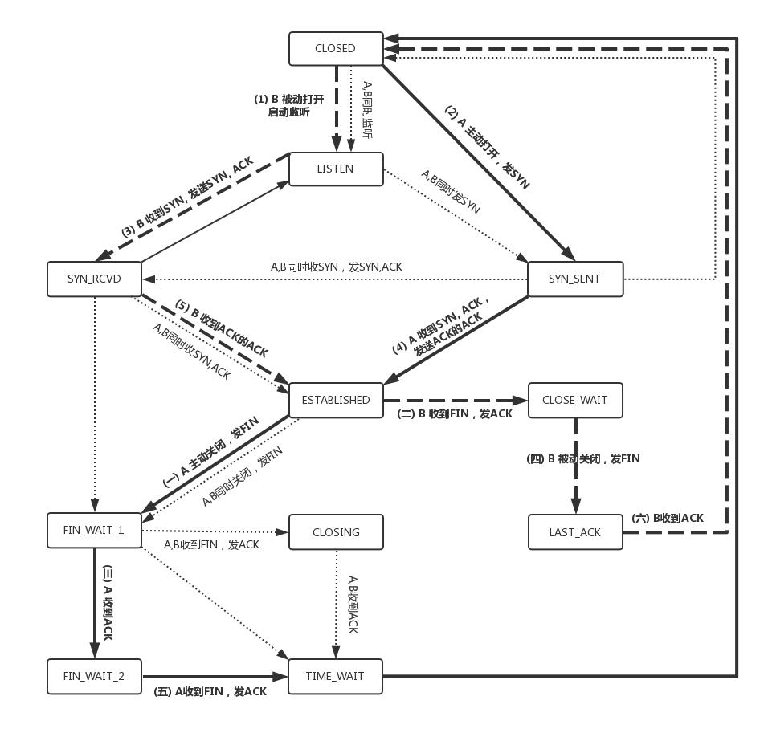
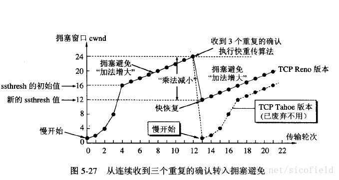
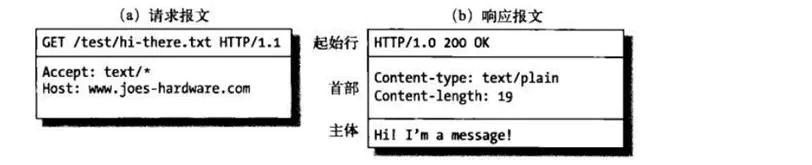
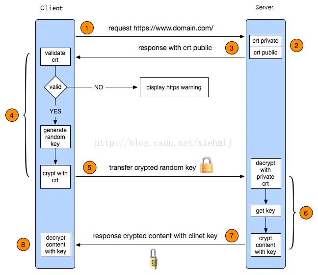

# NetWork
<!-- TOC -->

- [NetWork](#network)
    - [OSI](#osi)
    - [TCP](#tcp)
        - [状态图](#状态图)
        - [建立连接](#建立连接)
        - [释放连接](#释放连接)
        - [拥塞控制](#拥塞控制)
        - [backlog参数](#backlog参数)
    - [TCP与UDP的区别](#tcp与udp的区别)
    - [http](#http)
        - [请求与响应格式](#请求与响应格式)
        - [1.0、1.1及2.0的区别](#1011及20的区别)
    - [http与https区别](#http与https区别)

<!-- /TOC -->
## OSI
> OSI参考模型定义了网络互联中的七层架构，并规定了每层与相邻层的通信接口

+ 物理层  
> + IEEE802.11&#160; &#160;无线局域网  
> + IEEE802.3&#160; &#160;以太网  
+ 数据链路层    
> + PPP&#160; &#160;点对点传输协议
> + ARP&#160; &#160;地址解析协议（IP-->MAC） 
+ 网络层  
> + ARP&#160; &#160;地址解析协议（IP-->MAC）
> + RARP&#160; &#160;地址解析协议（MAC-->IP）
> + IP&#160; &#160;网络路由协议
> + ICMP&#160; &#160;控制报文协议
> + IGMP&#160; &#160;路由组播协议
> + OSPF&#160; &#160;链路状态路由协议
> + BGP&#160; &#160;边界网关路由协议
+ 传输层  
> + TCP&#160; &#160;可靠传输控制协议
> + UDP&#160; &#160;无连接的不可靠传输协议
> + NAT&#160; &#160;网络地址转换协议
+ 会话层  
+ 表示层
+ 应用层
> + http&#160; &#160;超文本传输协议
> + https&#160; &#160;加密超文本传输协议
> + ftp&#160; &#160;文件传输协议 
> + dns&#160; &#160;域名解析协议
> + dhcp&#160; &#160;ip地址分配协议
> + smtp&#160; &#160;邮件传输协议
> + pop3&#160; &#160;邮件下载协议
## TCP
### 状态图  
  
### 建立连接  
+ 客户端向服务端发送连接请求报文，首部中SYN=1，seq=x，客户端进入syn_sent状态  
+ 服务端收到连接请求报文，服务端进入syn_rcvd状态，发送连接请求的确认报文，首部中SYN=1，ACK=1，seq=y，ack=x+1  
+ 客户端收到确认报文，向服务端发送确认报文，首部中ACK=1，ack=y+1，客户端进入established状态，服务端收到确认报文后进入established状态  
+ 三次握手后，TCP连接建立成功
### 释放连接
+ 客户端向服务端发送连接释放报文，首部中FIN=1
+ 服务端收到连接释放报文，向客户端发送确认报文，首部中ACK=1
+ 服务端在确认自己没有数据发送的情况下，向客户端发送连接释放报文，首部中FIN=1
+ 客户端收到服务端的连接释放报文，发送确认报文，首部中ACK=1
+ 四次挥手后，TCP连接释放成功
### 拥塞控制  
> 拥塞控制是为了防止过多的流量注入网络中，造成网络阻塞，是网络中全局性的控制过程  
  
  
+ 慢启动，指数增长
+ 拥塞避免，加法增长
+ 出现拥赛进入快恢复  
### backlog参数  
> backlog参数是指TCP建立连接过程中维护的半连接队列大小与全连接队列大小  
> + 半连接队列：服务端收到客户端第一次握手连接建立请求SYN报文到收到客户端第三次握手的ACK报文之前，将该连接保存到半连接队列中  
> + 全连接队列：服务端收到客户端第三次握手ACK报文后，即服务端到达established状态，但还未被应用程序accept的连接，将该连接保存到全连接队列中  
  

+ 半连接队列大小由系统参数/proc/sys/net/ipv4/tcp_max_syn_backlog指定，默认为2048  
+ 全连接队列大小由/proc/sys/net/core/somaxconn和listen系统调用函数时传入的参数取最小值指定，默认为128  
> 半连接队列与全连接队列大小因合理设置（调大最好），如果设置过小，将造成无法响应处理更多的连接请求  
## TCP与UDP的区别
+ UDP
> + 无连接，尽最大努力交付的服务  
> + 无拥塞控制  
> + 首部开销小  
> + 具有较好的实时性,适合流媒体数据传输  
+ TCP  
> + 面向连接，具有高可靠性  
> + 面向字节流，有确认应答与超时重传机制  
> + 适用于可靠传输场景
## http
### 请求与响应格式
  
+ 响应码
> 1XX：请求以接受，等待处理  
> 2XX：处理成功  
> 3XX：重定向  
> 4XX：客户端错误  
> 5XX：服务端错误
### 1.0、1.1及2.0的区别
> + http1.0使用短连接，http1.1支持长连接  
> + http2.0与http1.1相比，使用二进制分帧传输  
> + http2.0与http1.0相比，支持多路复用，同一个连接并发处理多个请求  
## http与https区别
+ https建立连接过程  
> + 客户端向服务端发送https连接建立请求  
> + 服务端收到连接建立请求，向客户端返回公钥  
> + 客户端对公钥进行校验后，利用公钥对随机产生的会话秘钥进行加密  
> + 客户端将加密后的会话密钥发送到服务端  
> + 服务端利用私钥进行解密，获取到会话秘钥  
> + 客户端与服务端利用此会话密钥对传输的进行加密与解密  
  
