# 1. Redis
<!-- TOC -->

- [1. Redis](#1-redis)
    - [1.1. 数据类型](#11-数据类型)
    - [1.2. 内部数据结构](#12-内部数据结构)
        - [1.2.1. 实现原理](#121-实现原理)
        - [1.2.2. 对应关系](#122-对应关系)
        - [1.2.3. dict](#123-dict)
        - [1.2.4. sds](#124-sds)
        - [1.2.5. ziplist](#125-ziplist)
        - [1.2.6. skiplist](#126-skiplist)
        - [1.2.7. intset](#127-intset)
    - [1.3. 高级数据类型](#13-高级数据类型)
        - [1.3.1. HyperLogLog](#131-hyperloglog)
        - [1.3.2. geoHash](#132-geohash)
    - [1.4. 线程模型](#14-线程模型)
    - [1.5. 事件驱动](#15-事件驱动)
    - [1.6. 命令处理](#16-命令处理)
    - [1.7. 持久化](#17-持久化)
        - [1.7.1. RDB](#171-rdb)
        - [1.7.2. AOF](#172-aof)
    - [1.8. 事务](#18-事务)
        - [1.8.1. watch](#181-watch)
        - [1.8.2. 注意点](#182-注意点)
    - [1.9. 集群](#19-集群)
        - [1.9.1. Redis Cluster模式](#191-redis-cluster模式)
        - [1.9.2. Codis模式](#192-codis模式)
        - [1.9.3. 注意点](#193-注意点)
    - [1.10. 分布式锁](#110-分布式锁)
        - [1.10.1. 单节点实现](#1101-单节点实现)
        - [1.10.2. 多节点实现](#1102-多节点实现)
    - [1.11. 其它事项](#111-其它事项)
        - [1.11.1. 过期键删除策略](#1111-过期键删除策略)
        - [1.11.2. 内存淘汰策略](#1112-内存淘汰策略)

<!-- /TOC -->
## 1.1. 数据类型
+ string
+ list
+ set
+ sorted set
+ hash
## 1.2. 内部数据结构  
### 1.2.1. 实现原理
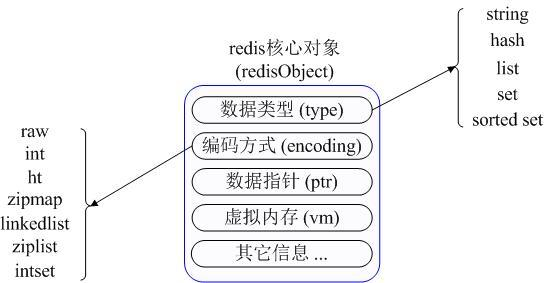  
+ Redis内部数据库使用dict维护key space到value space的映射关系，key space使用string类型，value space使用redisObject类型  
+ redisObject类型内部维护value的数据类型，使用的数据结构及数据指针指向真正的value存储位置等信息
### 1.2.2. 对应关系
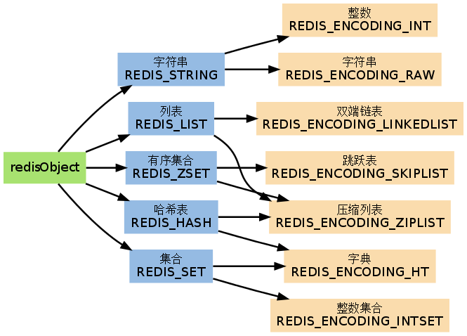
### 1.2.3. dict  
+ dict是维护key到value映射关系的数据结构，与哈希表类似  
+ Redis数据库中存储所有key到value的映射关系使用dict维护
+ Hash数据类型中Field属性域较多时也是使用dict维护
+ dict使用拉链法解决hash冲突，装载因子超过预定值时引发重哈希
+ 重哈希过程采用增量式重哈希方法，避免过度消耗系统资源，造成Redis服务响应迟钝
  
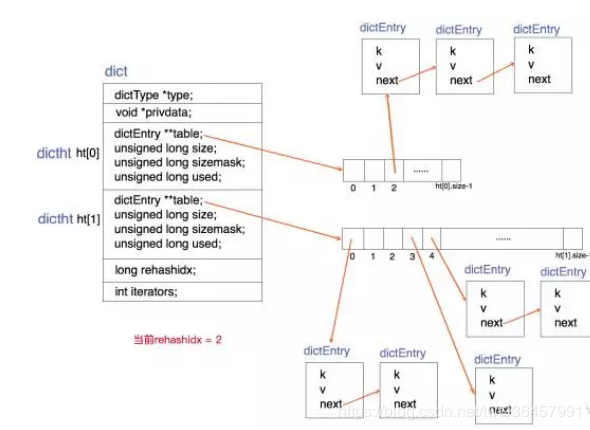  
### 1.2.4. sds  
+ Redis定义存储字符串的数据结构  
+ SDS是二进制安全的，既可以存储字符串也可以存储二进制文件
+ Redis采用空间预分配和惰性空间回收策略，避免对Redis性能造成影响
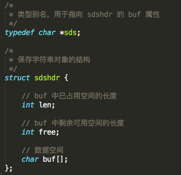
### 1.2.5. ziplist  
+ Redis为节约内存设计的数据结构，由连续内存块组成的顺序型数据结构
+ 当list与hash只包含少量元素且元素值为小型整数或短字符串时，使用ziplist存储  
  
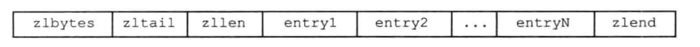
+ zlbytes&#160; &#160; 记录整个ziplist占用的总字节数
+ zltail&#160; &#160; 记录表尾节点相比ziplist起始位置的偏移量
+ zllen&#160; &#160; 记录ziplist包含的节点个数
+ entry&#160; &#160; ziplist包含的各个节点
+ zlend&#160; &#160;用于标记ziplist的尾端
### 1.2.6. skiplist  
+ skiplist通过在每个节点维护多个指向其它节点的指针，达到快速访问节点的目的  
+ skiplist是sorted set的底层数据结构实现  
  
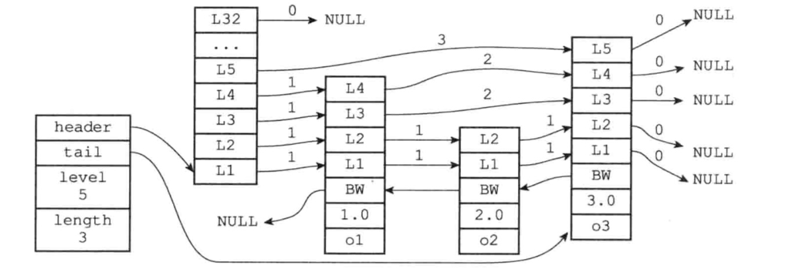
### 1.2.7. intset  
+ intset是Redis中set的底层数据结构支持之一 
+ 当集合中元素数目不多，且只包含整数值时，使用intset实现set数据类型
  
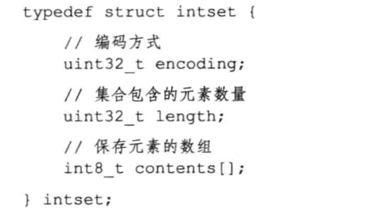

## 1.3. 高级数据类型  
### 1.3.1. HyperLogLog  
+ 数据基数统计（统计集合中不重复的元素个数）  
+ 内存消耗固定12k，可统计2^64个不同元素的基数
+ 利用贝努力概率统计原理，存在0.81%的统计误差，适用于千万级大数据量统计
+ 不包含contains操作，可结合bool过滤器设计  
+ 空间复杂度固定，时间复杂度在O（1）效率极高
### 1.3.2. geoHash  
+ 地理位置存储  
+ 内部使用zset数据类型存储  
+ 将二维的经纬度转换成一维的字符串，通过字符串前缀匹配表示位置相近程度  
+ 转换的字符串越长，匹配的精度越高
## 1.4. 线程模型
+ Redis使用IO多路复用模型  
> &#160; &#160; &#160; &#160;主线程同时监听多个Socket，每个Socket产生的事件会放入队列中排队，事件分配器每次从队列中取出一个事件，将事件分配到对应的事件处理器中处理  
+ Redis内部为保证跨平台，基于select与epoll实现了统一的事件处理机制，在编译时可选择采用何种IO多路复用机制  
  
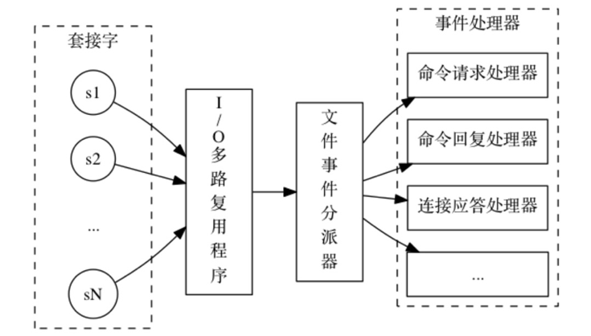
## 1.5. 事件驱动
+ Redis以单线程响应服务，利用IO多路复用机制，内部实现事件驱动机制
+ Redis内部事件分为timer定时事件与IO事件
+ Redis主线程事件驱动流程图  
  
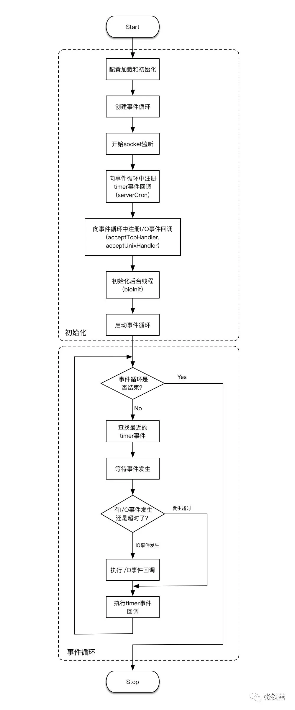
  
+ 主函数启动时首先加载配置文件进行系统初始化  
+ 创建事件循环，开始Socket监听，同时向事件循环中注册timer定时事件
+ 事件循环启动后，首先查找最近的定时事件，过程中如果发生IO事件，则执行IO事件
+ IO事件执行完毕后，如果查找到定时事件，则执行定时事件  
## 1.6. 命令处理  
> 由于Redis单线程的运行机制，Redis在执行以下时保证是原子性的操作  
> + 单个命令  
> + 事务  
> + lua脚本  
  
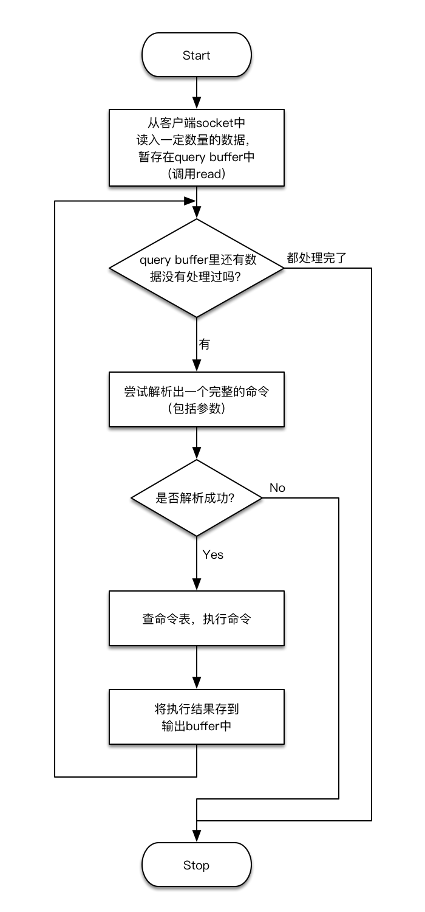
  
## 1.7. 持久化
### 1.7.1. RDB
+ Redis周期性的将当前时刻的内存快照写入rdb文件中  
+ 为避免RDB过程影响Redis性能，RDB会在子进程中运行  
+ fork的子进程与父进程共享内存代码段与数据段，当父进程收到修改指令时，采用Copy On Write机制，在复制的页面进行修改，保证子进程保存的内存数据是RDB开启时的内存数据  
+ 在配置文件中可以设置多少时间内发生键值的改变时，开始RDB
  
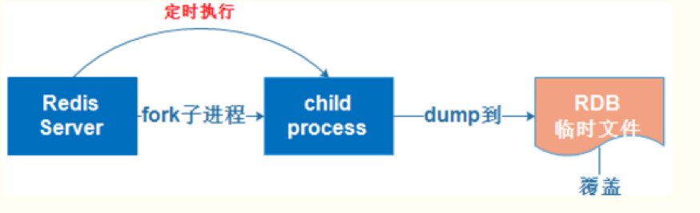  
### 1.7.2. AOF
+ 通过记录对内存数据修改的指令来实现持久化  
+ 为避免磁盘写入操作影响性能，Redis并不会直接将指令追加到磁盘aof文件中，而是先写入缓冲区，由操作系统异步的写入磁盘  
+ 通过修改配置文件中appendfsync参数，指定异步写入是每秒写入，每条指令写入，还是由操作系统决定何时写入  
+ 为避免aof文件过大，Redis提供aof重写功能，开启后，会根据当前Redis内存数据创建新的aof文件替换旧的aof文件
## 1.8. 事务
+ Redis事务不具备回滚，如果执行事务期间，发生错误，将继续执行事务中的Redis指令  
### 1.8.1. watch  
+ 事务执行前，可以watch任意数据的键，如果被watch的键没有发生修改，则执行当前事务，否则事务将被拒绝执行  
+ watch命令的引入，可以看成是一个乐观锁  
> &#160; &#160; &#160; &#160;由于Redis执行事务是原子性的，Redis不会在一个Redis事务的执行过程中插入执行另一个客户端发出的请求。可以将资源操作定义为事务，将代表资源的锁看成被watch的变量，只要这个变量在事务执行之前没有被修改，则执行事务，完成资源的操作  
### 1.8.2. 注意点
+ 由于Redis集群模式下操作的key可能存储在不同redis实例下，Redis集群不支持事务
## 1.9. 集群  
### 1.9.1. Redis Cluster模式  
  
+ Redis官方去中心化集群模式，每个节点都保存着整个集群的状态信息（包括slot的分配）
+ Redis使用分片的概念，整个划分为16384个slot，指定每个节点具体负责的slot(槽)  
+ 利用CRC16计算key属于的slot，从而存储到指定Redis节点中  
+ 集群中所有Redis主节点都可以接收client请求，hash计算完所属slot后，如果是自身节点，则处理键命令；否则回复MOVED重定向错误，通知客户端请求正确的节点  
> &#160; &#160; &#160; &#160; CRC16(key) & 16384  
+ 为保证整个集群的稳定性，可以给每个Redis节点配置主从结构，当Master宕机后，通过选举算法，将Slave提升为Master,以此提高集群的故障容灾能力  
### 1.9.2. Codis模式  
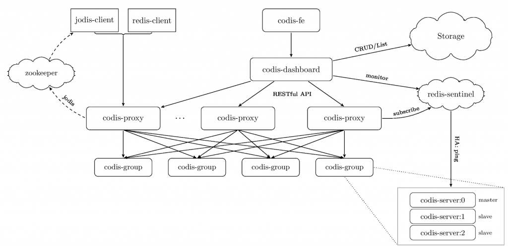  
+ Codis模式采用中间代理proxy形式实现Redis集群管理，由proxy转发Client端命令  
+ codis-proxy本身无状态，方便横向扩展，Redis集群slot分配等信息保存到zookeeper中  
+ Codis将所有key划分为1024个slot,利用CRC32计算key属于的slot，从而存储到指定Redis group中  
> &#160; &#160; &#160; &#160; CRC32(key) & 1024  
+ Redis group配置主从结构，各个Redis group独立
### 1.9.3. 注意点  
> 由于key被hash打散后分布在集群中不同Redis实例下  
+ Redis集群模式下批量操作命令mset等不支持  
+ Redis集群不支持事务
+ 不同Redis接入客户端对以上操作支持可能不同
## 1.10. 分布式锁
### 1.10.1. 单节点实现  
+ 锁申请  
> &#160; &#160; &#160; &#160;SET keyName requestID NX PX ttl  
> + keyName&#160; &#160;锁的名字
> + requestID&#160; &#160;用户的请求ID
> + NX&#160; &#160;如果keyName不存在，添加成功，否则添加失败
> + PX&#160; &#160;设置过期时间
> + ttl&#160; &#160;具体的过期时间  
+ 锁释放
> &#160; &#160; &#160; &#160;锁释放需要先判断requestID是否等于当前的requestID，如果不是，说明锁因为过期时间到，被Redis删除之后，由其它请求申请到了。如果相等，则删除，整个过程需要原子性的操作，借助lua脚本实现  
+ 存在的问题  
> &#160; &#160; &#160; &#160;如果锁因为过期时间到被Redis释放，使得其它request获取到锁，违法了锁的互斥原则  
+ 解决方案  
> + 在分布式锁的申请实现中增加一个版本号，每次有request申请锁，锁版本号递增
> + 获取到锁的request在访问资源时，比较自己获取到的版本号与锁的版本号，如果小于锁的版本号，说明有其它request获取到锁，应立刻释放锁，并停止访问资源
### 1.10.2. 多节点实现  
+ 利用多个独立的Redis节点实现高可用的分布锁
+ RedLock算法  
> 1.	获取当前的时间戳S
> 2.	顺序依次向集群中的Redis实例申请相同的锁
> 3.	当成功在大于等于N/2+1的Redis实例上申请成功时，记录申请锁花费的时间
> 4.	如果申请锁花费的时间小于锁的持续时长，则锁申请成功
> 5.	返回申请成功的消息，锁的可用时间为锁的持续时间减去锁申请花费的时间
> 6.	如果不满足申请成功的条件，则在申请成功的Redis实例上执行锁释放的操作
## 1.11. 其它事项  
### 1.11.1. 过期键删除策略
+ 惰性删除  
> &#160; &#160; &#160; &#160;当客户端查询键时，根据查询的时间戳与键创建的时间戳来判断键是否过期，如果过期则删除，否则返回查询的键值。惰性删除会造成如果键未被查询，将无法被删除，占用的内存也无法被释放  
+ 定时删除  
> &#160; &#160; &#160; &#160;Redis会定时随机抽取一些键判断它是否过期，如果过期则删除。随机抽取一些键而非全盘扫描是为避免定时删除影响Redis的性能
### 1.11.2. 内存淘汰策略
> 当出现内存不足时，Redis会采用内存淘汰策略，淘汰一些键，释放出内存空间，目前主要有以下几种策略：
+ volatile-lru：从已设置过期时间的键中，选择最近最少使用的键淘汰
+ volatile-ttl：从已设置过期时间的键中，选择快要过期的键淘汰
+ volatile-random：从已设置过期时间的键中，随机选择键淘汰
+ allkeys-lru：从所有键中，选择最近最少使用的键淘汰
+ allkeys-random：从所有键中，随机选择键淘汰  
+ no-eviction：当内存不足时，不淘汰键，直接禁止写入 **[很少使用]**  
  
[@SiwangHu](https://github.com/siwanghu)