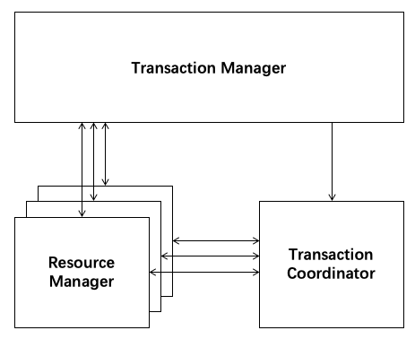

<!-- TOC -->

- [分布式事务](#分布式事务)
    - [2PC](#2pc)
        - [2PC流程](#2pc流程)
        - [2PC缺陷](#2pc缺陷)
- [Seata](#seata)
    - [Seata组成](#seata组成)
    - [AT模式](#at模式)
        - [隔离性](#隔离性)
    - [TCC模式](#tcc模式)
        - [隔离性](#隔离性-1)
    - [SAGA模式](#saga模式)
        - [隔离性](#隔离性-2)
    - [异常控制](#异常控制)

<!-- /TOC -->
# 分布式事务  
  
## 2PC  
+ 两阶段事务提交协议，由协调者和参与者共同完成  
  
| **角色** | **XA概念** | **作用** |  
| ------ | ------ | ------ |  
| 协调者 | 事务管理器 | 协调各个参与者，对分布式事务进行提交或回滚 |  
| 参与者 | 资源管理器 | 分布式集群中的节点，分布式事务参与者 |  
### 2PC流程
+ 第一阶段：准备阶段  
> 1. 协调者向所有的参与者询问，并开始等待各参与者的响应  
>  
> 2. 参与者执行本地事务操作,并将Undo和Redo信息记入事务日志中，但不提交  
>  
> 3. 参与者成功执行了事务操作，反馈协调者Yes响应；否则返回No响应给协调者，表示事务不可以执行提交  
>  
 
+ 第二阶段：提交阶段  
> 1. 协调者在收到所有参与者的事务执行成功响应后，向所有的参与者发送全局事务提交  
  
  
> 2. 协调者收到参与者的事务执行失败响应（或超时未收到参与者的任何响应），向所有的参与者发送全局事务回滚  
  
  
### 2PC缺陷  
+ 同步阻塞：所有参与节点都是事务阻塞型，事务执行期间参与者占有数据库资源时，其他第三方访问数据库资源都将处于阻塞状态  
+ 单点问题：全流程依赖协调者的协调，一旦协调者发生故障，参与者会一直阻塞下去，直到等待协调者重新上线后才能继续工作  
+ 容错性不好：协调者只能依靠其自身的超时机制，判断是否需要中断事务，任意一个节点的失败都会导致整个事务的回滚  
+ 数据不一致：协调者在尚未发送完所有提交请求之前自身发生了崩溃或存在参与者因为网络故障没有收到提交请求，将导致数据的不一致性  
# Seata  
+ Seata开源分布式事务框架，致力于提供高性能的分布式事务服务  
+ Seata提供AT、TCC、SAGA事务模式，为用户打造简单易用的分布式事务解决方案 
## Seata组成  
  
| **角色** | **XA概念** | **作用** |  
| ------ | ------ | ------ |  
| TC | 事务协调器 | 维护全局事务和分支事务的状态，驱动全局提交或回滚，独立运行的组件 |  
| TM | 事务管理器 | 定义全局事务的范围:开始全局事务、提交或回滚全局事务 |  
| RM | 资源管理器 | 管理分支事务，向TC注册分支事务并报告分支事务的状态，驱动分支事务提交或回滚 |  
  
TC将全局事务与分支事务的状态信息存储在DB中：  
> + 全局事务信息-->global_table  
> + 分支事务信息-->branch_table  
> + 全局锁信息-->lock_table  
## AT模式  
> 两阶段提交协议  
+ 第一阶段  
> 1. 业务数据和回滚日志记录在同一个本地事务中提交，成功立即释放本地锁和连接资源  
  
  
+ 第二阶段  
> 1. 提交异步化，立即释放全局锁，非常快速地完成（仅需删除第一阶段的undo_log日志）  
  
  
> 2. 回滚通过一阶段的回滚日志生成逆向Sql进行反向补偿  
  
  
### 隔离性  
+ 写隔离  
> 对于写操作，本地事务在提交之前必须要获取到数据的全局锁才能提交，有效避免脏写  
+ 读隔离  
> Seata默认工作在全局读未提交隔离级别下，如果要求全局读已提交，使用SELECT FOR UPDATE语句获取全局锁保证读已提交（Seata检测到FOR UPDATE后缀时，会申请全局锁）  
## TCC模式  
> 1. TCC模式是资源管理器的一种服务化的实现  
> 2. 可用于解决跨数据库、跨服务业务操作的数据一致性问题  
+ 第一阶段  
> 1. Try阶段执行业务检查及资源预留  
+ 第二阶段  
> 1. Confirm阶段执行资源提交,保证执行成功。若Confirm阶段执行出错，进行重试或人工处理  
> 2. Cancel阶段执行预留资源的取消，使资源回到初始状态。若Cancel阶段执行出错，进行重试或人工处理  
  
  
### 隔离性  
> 交由业务层在设计实现上进行保证（业务隔离）  
+ 写隔离设计  
> try阶段进行业务检查及资源预留，预加或预扣的资源其它事务无法操作，避免脏写  
+ 读隔离设计  
> try阶段只进行业务检查及资源预留，不实际立马增加或扣除资源，不会影响用户查询到实际数据，避免脏读  
## SAGA模式  
+ Saga模式是Seata提供的长事务解决方案  
+ 由一阶段正向服务和二阶段补偿服务组成  
  
  
### 隔离性  
+ 一阶段直接提交本地事务，无锁，不保证隔离性
## 异常控制  
+ 允许空回滚  
+ 幂等控制  
+ 防悬挂  