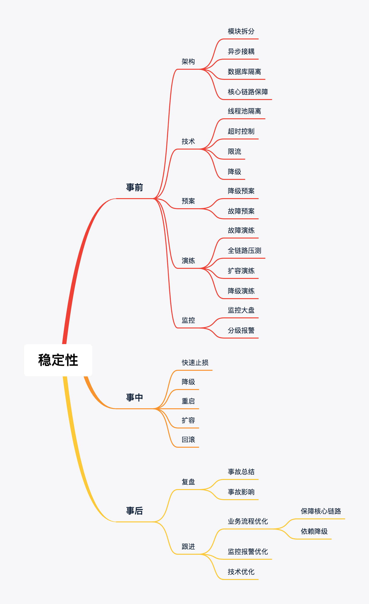

<!-- TOC -->

- [微服务](#微服务)
    - [稳定性](#稳定性)
        - [核心链路梳理](#核心链路梳理)
        - [技术点改造](#技术点改造)
        - [监控和报警](#监控和报警)
        - [定期演练](#定期演练)

<!-- /TOC -->
# 微服务  
## 稳定性  
> &nbsp;&nbsp;&nbsp;&nbsp;&nbsp;服务本身的稳定性是业务正常运行的核心前提；研发环节中，提高稳定性意识；事故出现时，保证线上问题快速定位、相关业务快速止损(对内挽回资产，对外补偿用户)、核心链路快速恢复  
  

### 核心链路梳理
+ 核心链路通盘梳理，依赖的外部模块也应该在考虑的范围之内  
+ 前端人员参与，避免出现后端非核心链路的失败而阻塞了用户的核心行为
### 技术点改造  
+ 模块拆分  
> 核心模块与非核心模块进行拆分，降低事故出现时对核心模块造成的影响
+ 异步改造  
> 将过长的核心链路异步化，基于线程池的异步任务改造核心链路，保障核心链路快速返回
+ 异步Check  
> 异步定时主动核对数据，避免数据出现异常或异步回调没有触发
+ 数据库隔离  
> B端库和C端库隔离，核心库与非核心库隔离，保护核心的数据库
+ 线程池隔离  
> 核心业务和非核心业务在线程池使用上隔离
+ 一键降级  
> 确认降级方案，事故出现时快速止损
+ MQ监控  
> 对MQ中发送失败，发送延迟拉高，消费异常，消息堆积等异常进行监控
+ 扩容方案  
> 事先设计扩容方案，应对突发流量时保证系统运行的稳定性
### 监控和报警  
+ 业务核心指标监控  
+ 系统核心链路监控  
+ 系统核心日志查看  
+ 服务调用链路监控  
> 梳理业务核心指标，对核心指标进行实时监控。比如购买次数，成单量，成单金额等等。核心指标有异动，立马报警  
### 定期演练  
+ 故障演练  
+ 一键降级演练  
+ 扩容演练  
+ 全链路压测演练  