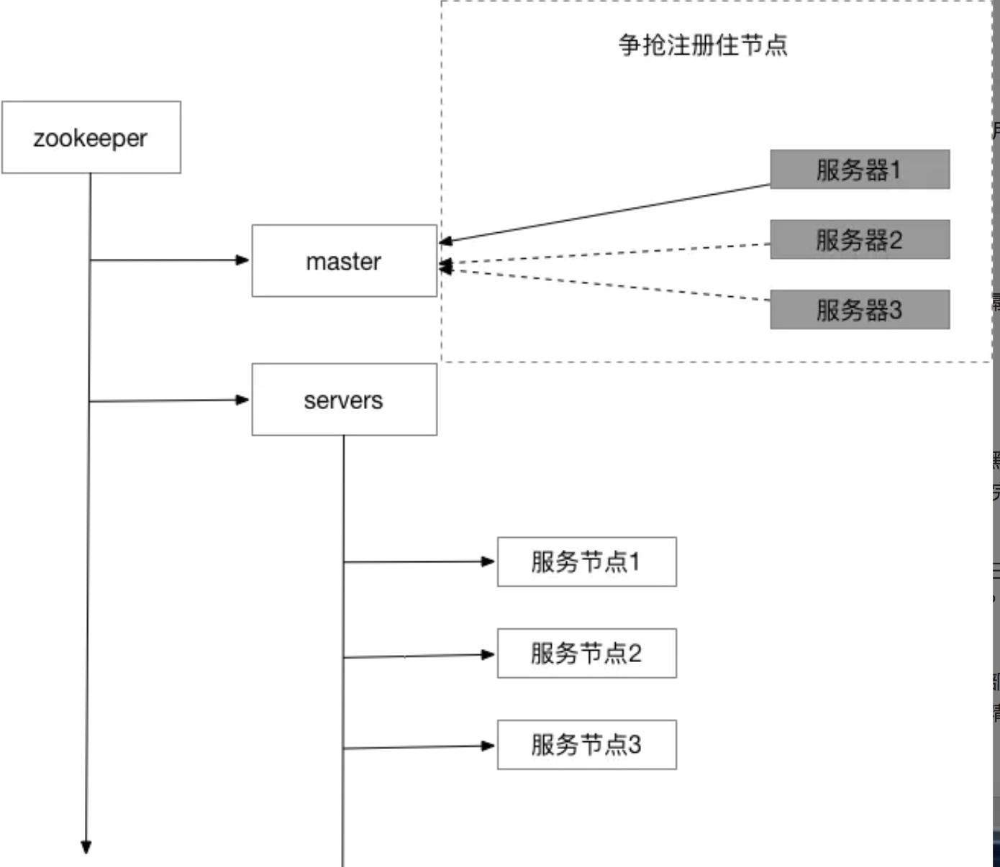

<!-- TOC -->

- [ZooKeeper](#zookeeper)
    - [数据模型](#数据模型)
    - [Zookeeper特性](#zookeeper特性)
    - [节点（ZNode）](#节点znode)
        - [节点类型](#节点类型)
    - [Watch机制](#watch机制)
    - [ACL机制](#acl机制)
        - [schema](#schema)
        - [id](#id)
        - [permission](#permission)
    - [数据存储](#数据存储)
        - [内存数据](#内存数据)
        - [事务日志](#事务日志)
        - [快照](#快照)
    - [集群](#集群)
        - [角色](#角色)
    - [ZAB协议](#zab协议)
        - [消息广播](#消息广播)
        - [奔溃恢复](#奔溃恢复)
            - [关键性保证](#关键性保证)
            - [选举Leader](#选举leader)
    - [应用场景](#应用场景)
        - [分布式锁](#分布式锁)
        - [心跳感知](#心跳感知)
        - [命名服务](#命名服务)
        - [均衡负载](#均衡负载)
        - [配置管理](#配置管理)
        - [Leader选举](#leader选举)

<!-- /TOC -->
# ZooKeeper
+ 分布式协调服务开源框架,旨在解决分布式集群中应用系统的一致性问题  
+ 通过维护类似文件系统目录树方式进行数据存储，客户端通过监控数据状态的变化达到集群管理目的  
+ Leader处理事务性写请求,Follower只处理读请求，Follower接收到写请求将转发给Leader处理  
## 数据模型
+ 层次化目录结构存储数据
+ 节点（ZNode）存储关联的数据以及子节点
  
  
+ 数据存储在内存中，访问速度非常快  
## Zookeeper特性  
+ 单一视图  
> 1. 同一客户端无论什么时候连接到ZK集群中任意服务器，都不会看到比自己之前看到的更早版本的数据  
> 2. 客户端携带自身最新的事务zxid，如果服务器事务zxid小于客户端的事务zxid，则拒绝连接，客户端尝试连接其它服务器  
+ 原子性  
> 1. 更新成功或失败,不存在中间状态的结果  
> 2. ZAB原子广播协议保证更新操作的原子性  
+ 顺序一致性  
> 1. 来自同一客户端的更新请求将按照其发送顺序进行执行  
+ 可靠性  
> 1. 数据更新执行成功，它将从那时起持续到客户端覆盖更新  
+ 及时性  
> 1. 客户端会在一定的时间范围内得到最新的数据
## 节点（ZNode）
### 节点类型  
+ 临时节点(EPHEMERAL)  
> 不支持子节点，会在与客户端会话结束时删除或客户端主动删除  
+ 持久节点(PERSISTENT)  
> 支持子节点，持久化的（除非客户端主动删除）
+ 临时顺序节点(EPHEMERAL_SEQUENTIAL)  
> 临时节点，父节点会为一级子节点记录节点的创建顺序   
+ 持久顺序节点(PERSISTENT_SEQUENTIAL)  
> 持久节点,父节点会为一级子节点记录节点的创建顺序  
## Watch机制  
+ 客户端通过监听ZooKeeper节点对象，当被监听的节点对象状态发生改变时，会通知所有监听的客户端  
+ Watch触发之后失效，客户端需要重新监听（避免ZooKeeper保存过多Watch影响性能）  
+ ZooKeeper只发送触发的事件类型（避免过多网络开销影响ZooKeeper的性能)  
  
  
+ 客户端的watch执行线程串行执行所有watch回调函数，避免单个Watcher的处理逻辑影响整个客户端的Watcher回调处理  
## ACL机制  
+ ZooKeeper中用于控制节点的访问权限  
+ 每个znode的权限都是独立控制，没有继承关系  
+ 分为scheme:id:permission三个维度 **{schema授权策略，id用户，permission权限}**  
### schema  
> 定义采用何种方案进行权限管理  
+ world **{只存在唯一id,anyone,world:anyone代表任何人}**  
+ auth **{不需要id，通过authentication的user都有权限}**  
+ digest **{id为username:BASE64(SHA1(password))}**  
+ ip **{设置允许访问的ip段}**  
+ super **{对应的id拥有超级权限，可以做任何事情,cdrwa}**  
### id
> 验证模式，不同的schema对应不同的客户端访问验证方式  
### permission  
> 客户端访问节点的控制权限  
+ CREATE(c): 创建权限，可以在在当前node下创建child node，即对子节点Create操作  
+ DELETE(d): 删除权限，可以删除当前的node，即对子节点Delete操作  
+ READ(r): 读权限，可以获取当前node的数据，可以list当前node所有的child nodes，即对本节点GetChildren和GetData操作  
+ WRITE(w): 写权限，可以向当前node写数据，即对本节点SetData操作  
+ ADMIN(a): 管理权限，可以设置当前node的permission，即对本节点setAcl操作  
## 数据存储  

+ leader生成对应的事务proposal，并将其发送给集群中所有follower机器  
+ follower收到proposal后,将该proposal**写入到事务日志**，然后反馈ACK给leader  
+ leader收到过半follower的ACK后，广播commit消息给所有follower  
+ follower收到commit消息后将**事务应用到内存中** 
### 内存数据
+ DataTree  
> 内存数据存储，利用concurrentHashMap存储数据，Key为节点路径，value为DataNode  
+ DataNode  
> 存储节点数据，ACL信息等  
+ ZKDatabase  
> 管理Zookeeper所有会话、DataTree存储和事务日志，定时dump内存快照  
  

### 事务日志  

### 快照

## 集群
  
### 角色  
+ Leader  
> 1. 事务请求的唯一调度和处理者，保证集群事物处理的顺序性  
+ Follower  
> 1. 处理客户端非事务请求、转发事务请求给leader服务器  
> 2. 与事务请求Proposal投票、参与Leader选举的投票  
> 3. 需要半数以上Follower服务器通过,leader才能commit数据  
+ Observer  
> 1.  同步集群服务器状态、不参与任何形式的投票  
> 2. Observer服务器只提供非事物请求服务  
## ZAB协议  
+ ZooKeeper维持数据一致性的核心协议
+ Discovery 发现  
+ Synchronization 同步  
+ Broadcast 广播  
  

### 消息广播  
1. Leader接收到客户端新的事务请求后，生成新的事务Proposal，并根据zxid顺序向所有Follower发送提案  
2. Follower根据消息接收的先后次序处理来自Leader的事务Proposal，并将它们追加到事务日志中，并反馈ACK给Leader  
3. 当Leader接收到过半Follower的ACK响应后，向所有Follower发送commit请求，进行事务提交  
4. Follower接收到commit请求后，进行事务的提交（ZAB协议要求Follower必定已提交了小于当前事务zxid之前的事务）  
> + 每个follower节点都会有一个先进先出（FIFO)的队列用来存放收到的事务请求，保证执行事务的顺序  
> + 可靠提交由ZAB的事务一致性协议保证,全局有序由TCP协议保证,因果有序由follower的历史队列(history queue)保证  
> + 当follower收到commit请求时，会判断该事务的ZXID是不是比历史队列中的任何事务的ZXID都小，如果是则提交，如果不是则等待比它更小的事务的commit
### 奔溃恢复  
#### 关键性保证
+ 已经被处理的消息不能丢失  
> 客户端收到事务消息处理成功的回执,集群中存在Follower在没有收到commit之前Leader崩溃，重新选举Leader后，该消息不能丢失
+ 被丢弃的消息不能再次出现  
> Leader接收到消息请求生成proposal后奔溃，其他Follower并没有收到此Proposal，重新选举Leader后，该Proposal将丢弃  
+ 选举出所有机器中具有最高ZXID的事务Proposal做为新Leader
#### 选举Leader  
+ 服务器状态变更为Looking，初始化自身的zxid和epoch，向其他所有节点发送选主通知  
+ 服务器根据自身的zxid和epoch与收到的其它节点发布的选票信息，更新选票信息并广播更新结果  
+ 当集群中存在节点获得过半选票，该节点状态由Looking变更为Leader。其它节点状态由Looking变更为Follower
+ 选票比较原则  
> 1. epoch(A) >  epoch(B) **{epoch,当前集群所处的周期，选出新Leader，+1}**
> 2. zxid(A) > zxid(B)  **{zxid,事务ID，新的事务请求，+1}**  
> 3. sid(A) > sid(B) **{sid,节点编号}**  
+ zxid高32位代表epoch，低32为计数事务请求序号。高32位或低32位达到最大值溢出后会触发集群重新选举。
## 应用场景  
### 分布式锁  
  
+ 创建代表分布式锁前缀持久节点/my_lock，每个需要获取锁的进程在该节点下创建临时顺序节点  
+ 判断节点序号是否是第一个，如果是则加锁成功；如果不是，则watch上一个序号比自己小的节点状态变化  
+ 获取锁成功的进程主动删除自己创建的临时顺序节点来到达释放锁的目的（客户端异常崩溃，因为是临时节点，客户端在异常崩溃的情况下，ZooKeeper会主动删除该节点，防止死锁的发生）  
+ 获取锁的进程删除节点释放锁，触发watch机制，ZooKeeper通知下一个待获取锁的进程，该进程再次判断自身是否是当前序号最小的，如果是则获取锁成功  
### 心跳感知  
> 许多场景下，需要获取集群中节点的健康状态情况，集群往往需要提供节点心跳感知能力  
+ 创建代表集群健康状态的持久节点/cluster，每个需要提供心跳感知的节点在该节点下创建临时节点保存健康状态  
+ 如果集群中存在节点异常崩溃，ZooKeeper会主动删除该临时节点。通过获取/cluster节点下的所有临时子节点，感知集群中所有节点的健康状态  
### 命名服务
> 命名服务的功能主要是根据指定名字来获取资源或服务的地址，提供者等信息。利用ZooKeeper节点的特性及Watch机制，可以实现动态注册和获取服务信息的配置中心，统一管理服务名称和其对应的服务器列表信息，能够做到近乎实时地感知到后端服务器的状态(上线、下线、宕机)  
  
  
+ 创建代表服务提供者信息的持久节点/service
+ 服务提供者上线时在/service节点下创建临时节点保存服务提供者的信息  
+ 服务消费者watch该/service节点的状态变化，存在服务提供者上线或下线时，ZooKeeper主动推送消息到服务消费者
+ 服务消费者通过获取/service节点下所有临时子节点来获取服务提供者的信息  
+ 服务提供者异常奔溃时，ZooKeeper会主动删除该临时节点，触发watch，服务消费者更新服务提供者信息列表  
### 均衡负载  
> 利用ZooKeeper实现客户端软负载均衡  
+ 基于命名服务原理实现，利用ZooKeeper的节点及Watch机制，实时感知获取服务提供者上线、下线信息，客户端实时同步服务提供者列表    
+ 客户端在本地利用负载均衡算法实现软负载均衡  
### 配置管理  
> 实际应用场景中，服务器需要维护统一的配置管理中心，当配置更新时，服务器主动监听配置的变化并应用，避免重复发布修改服务器（在集群中服务器数量众多时，提升生产效率，由其重要）  
+ 利用ZooKeeper节点保存相关配置信息，服务器watch配置节点，当节点数据发生改变时，触发watch，服务器获取配置并应用到集群中  
  
  
### Leader选举  
> 同时有多个客户端请求创建/Master临时节点，ZooKeeper保证最终一定只有一个客户端请求能够创建成功。利用这个特性，可以很轻易的在分布式环境中进行集群的Leader选举  
  
  
+ 多个客户端请求创建/master临时节点，创建成功的客户端成为master。创建失败的则监听/master临时节点，以备master待机后，其它客户端可以进行抢主操作
+ 同时为方便管理集群中各个服务器的健康状态，可以选择在特定节点下，创建代表服务器健康状态的临时节点  
[@SiwangHu](https://github.com/siwanghu)